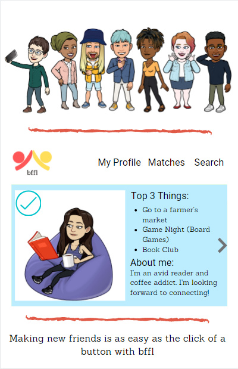
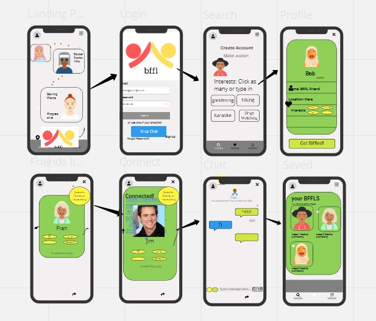

# FriendApp

## Description

This application uses MERN to allows users to find and match with friends online. They will have the option of filtering for users near their location as well as preferences for shared interests, and parameters for ages, gender, etc.
Users will select an avatar/bitmoji instead of a profile photo to focus on other forms of interaction before revealing what users look like.

## Table of Contents

- [Installation](#installation)
- [Usage](#usage)
- [Credits](#credits)
- [License](#license)

## User Story

As a USER, I want to make friends.
As a USER, I want to build a personal profile with my information and preferences.
Based on filtering criteria, I want to find other users that I can match with to start a conversation.

## Installation

Step 1: Run NPM install
Step 2: Do the rest

## Usage

Provide instructions and examples for use. Include screenshots as needed.

## Credits

Collaborators:

Rebecca Blanton
Robert Koepp
Joshua Ordaz
Jessica Tax
Violet Pickard
Alex Bachicha

## License

Technologies Used:

REACTJS
Node and Express Web Server
MongoDB
Mongoose
Socket.io
SnapKit
Multer
Next.js
Geocaching
